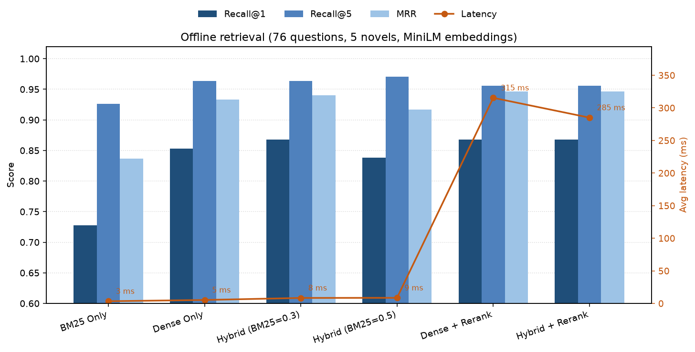
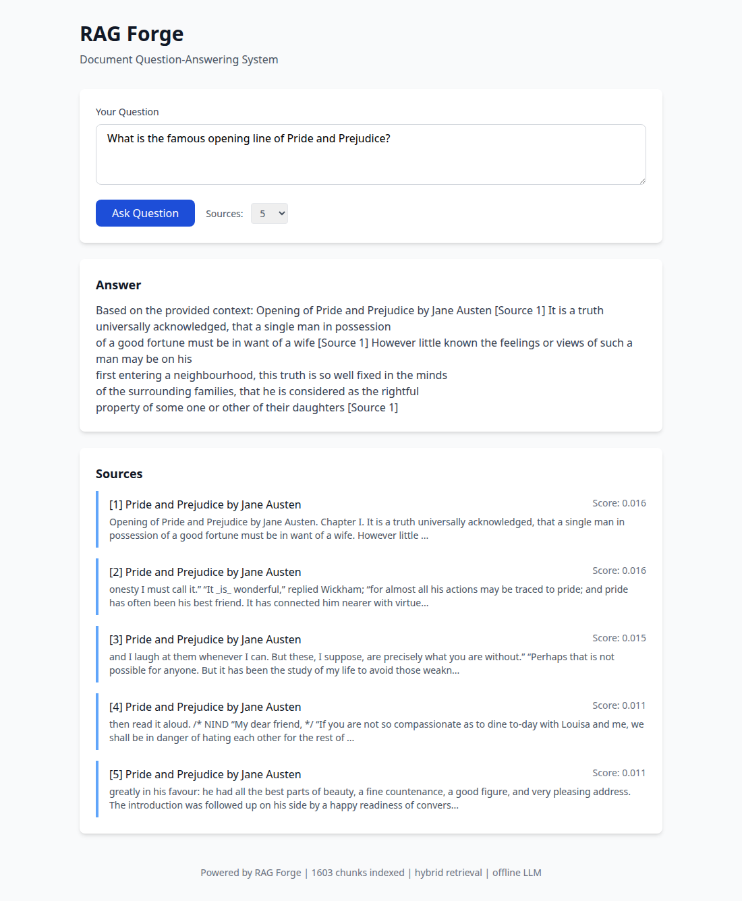

# RAG Forge

[](https://github.com/SmitHunter/rag-forge/actions/workflows/ci.yml)
[](https://www.python.org/downloads/)
[](LICENSE)



Offline retrieval-only eval (`scripts/run_eval.py --offline`) on a 4-core Intel Xeon, no GPU. Chart: `scripts/plot_eval_results.py`.

A production-grade **Retrieval-Augmented Generation (RAG)** document question-answering system with a rigorous evaluation harness. Built to demonstrate real AI engineering depth with clean architecture, comprehensive testing, and quantitative evaluation.

## The Problem

Large Language Models are powerful but suffer from hallucination and knowledge cutoffs. RAG addresses this by grounding responses in retrieved documents, but building an effective RAG system involves many design decisions:

- **Chunking strategy**: How to split documents while preserving semantic coherence
- **Retrieval method**: Sparse (BM25), dense (embeddings), or hybrid approaches
- **Reranking**: Whether to add a cross-encoder for better precision
- **Provider flexibility**: Support for different LLMs and embedding models

This project implements a complete RAG pipeline with **configurable components** and an **evaluation harness** to measure the impact of these choices quantitatively.

## Architecture

```mermaid
flowchart TB
    subgraph Ingestion
        D[Documents] --> C[Chunker]
        C --> |Fixed/Sentence/Paragraph/Semantic| CH[Chunks]
    end
    
    subgraph Indexing
        CH --> BM25[BM25 Index]
        CH --> EMB[Embedding Provider]
        EMB --> |OpenAI/SentenceTransformers/Offline| FAISS[FAISS Index]
    end
    
    subgraph Retrieval
        Q[Query] --> HYB{Hybrid Retriever}
        HYB --> |BM25 Weight| BM25
        HYB --> |Dense Weight| FAISS
        BM25 --> RRF[RRF Fusion]
        FAISS --> RRF
        RRF --> |Optional| RR[Cross-Encoder Reranker]
        RR --> TOP[Top-K Chunks]
    end
    
    subgraph Generation
        TOP --> LLM{LLM Provider}
        LLM --> |OpenAI/Anthropic/Local/Offline| ANS[Answer + Citations]
    end
    
    subgraph Evaluation
        QA[QA Dataset] --> EVAL[Eval Harness]
        EVAL --> |Recall@k, MRR| RM[Retrieval Metrics]
        EVAL --> |Faithfulness, Abstention| AM[Answer Metrics]
    end
```

### Key Components

| Component | Description |
|-----------|-------------|
| **Chunking** | Fixed-size, sentence-based, paragraph-based, or semantic chunking strategies |
| **Retrieval** | BM25 sparse retrieval, dense embedding retrieval (FAISS), or hybrid with RRF fusion |
| **Reranking** | Optional cross-encoder reranking for improved precision |
| **Providers** | Pluggable LLM (OpenAI, Anthropic, local, offline) and embedding (OpenAI, SentenceTransformers, offline) providers |
| **Evaluation** | Comprehensive harness measuring retrieval (Recall@k, MRR) and answer quality (faithfulness, abstention) |

## Quickstart

### Installation

```bash
# Clone the repository
git clone https://github.com/SmitHunter/rag-forge.git
cd rag-forge

# Install with pip (Python 3.10+)
pip install -e ".[dev]"

# For OpenAI/Anthropic support:
pip install -e ".[all]"
```

### Download Sample Data

The project uses public domain literature from Project Gutenberg:

```bash
python scripts/download_data.py
```

This downloads 5 classic novels (~3MB of text). The curated 76-question QA set is already in `data/qa_dataset.json` and is **not** overwritten by the download script.

### Build Index and Query (retrieval-only / offline)

Default LLM mode is `offline`: a deterministic template that extracts sentences from retrieved chunks. No API keys, no model download. This is the retrieval-only baseline used in the eval table below.

```bash
# Ingest documents and build index (Hybrid BM25=0.3 — best first-stage)
rag-forge ingest --data-dir data --retrieval hybrid

# Ask a question (offline template generation)
rag-forge query "What is the opening line of Pride and Prejudice?"

# Same hybrid index can be queried with a single-method retriever
rag-forge query "How did Frankenstein create his monster?" --retrieval bm25
rag-forge query "What is Sherlock Holmes's address?" --retrieval dense
```

### Generate with a local open-weight model (Ollama)

The full retrieve + generate path uses [Ollama](https://ollama.ai). Tests mock this provider; you only need Ollama installed to run it for real.

```bash
# 1. Install Ollama: https://ollama.ai/download
# 2. Start the server (often starts automatically on desktop install)
ollama serve

# 3. Pull a small open-weight model (~1.3GB)
ollama pull llama3.2:1b

# 4. Query with the local provider
rag-forge query "What is Sherlock Holmes's address?" \
  --llm-provider local --llm-model llama3.2:1b

# Optional: serve the web UI with local generation
rag-forge serve --llm-provider local --llm-model llama3.2:1b --port 8000
```

Environment variables: `RAG_FORGE_LLM_PROVIDER=local`, `RAG_FORGE_LLM_MODEL=llama3.2:1b`, `RAG_FORGE_OLLAMA_HOST` or `OLLAMA_HOST` (default `http://localhost:11434`). If `--llm-model` is omitted, the local provider remaps the Settings cloud default (`gpt-4o-mini`) to `llama3.2:1b`.

Any Ollama-compatible model works (`mistral:7b`, `llama3.1:8b`, …). Smaller models are faster; larger models write better answers.

Cloud APIs are also wired: `--llm-provider openai` / `--llm-provider anthropic` with `RAG_FORGE_OPENAI_API_KEY` or `RAG_FORGE_ANTHROPIC_API_KEY`.

### Run Evaluation

```bash
# Run the full evaluation harness
rag-forge evaluate --data-dir data --qa-file data/qa_dataset.json

# Retrieval-only baseline (offline template, no model)
python scripts/run_eval.py --offline

# Generated-answer eval with a local Ollama model (subset of configs)
RAG_FORGE_LLM_MAX_TOKENS=256 python scripts/run_eval.py \
  --llm-provider local --llm-model llama3.2:1b \
  --configs "Dense Only,Hybrid (BM25=0.3)"
```

### Start Web UI

Default LLM mode is `offline` (no API key). Ingest first so `/health` reports indexed chunks.

```bash
rag-forge ingest --data-dir data --retrieval hybrid
rag-forge serve --port 8000
```

Open http://localhost:8000. Screenshot: a real local run of the dataset question *"What is the famous opening line of Pride and Prejudice?"* (hybrid retrieval, offline template generation, 1,603 chunks). The top source contains the gold quote. The template extracts sentences from retrieved chunks; it is not a fluent generator.



## Evaluation Results

Results from running the evaluation harness on the classic literature corpus (5 documents, 1,603 chunks after front-matter stripping, 76 QA pairs including paraphrased, multi-hop, cross-chunk, and unanswerable questions). Embeddings: SentenceTransformers `all-MiniLM-L6-v2`. Answer generation: offline template mode (retrieval-only baseline). Hardware: 4-core Intel Xeon, no discrete GPU. The hero chart is plotted from this table.

Retrieval scores on this VM matched the previously published table. Rerank latency is machine-dependent: 285–315ms here vs 252–262ms in the earlier write-up. Hybrid (BM25=0.5) first-stage latency rounded to 9ms (was 8ms).

```bash
python scripts/run_eval.py --offline --output eval_results.json
python scripts/plot_eval_results.py --input eval_results.json --output docs/offline_retrieval_metrics.png
```

Requires `pip install -e ".[viz]"` (matplotlib) for the plot script.

Raw output from `python scripts/run_eval.py --offline` on a 4-core Intel Xeon (no GPU): [`results/offline_eval.json`](results/offline_eval.json). Retrieval scores in that file match this table (rounded to 3 decimals). Latency is this machine's: Hybrid (BM25=0.5) 9ms; Dense + Rerank 315ms; Hybrid + Rerank 285ms.

| Configuration | Recall@1 | Recall@5 | MRR | Faithfulness | Latency |
|---------------|----------|----------|-----|--------------|---------|
| BM25 Only | 0.728 | 0.926 | 0.837 | 0.807 | 3ms |
| Dense Only | 0.853 | 0.963 | 0.933 | 0.802 | 5ms |
| Hybrid (BM25=0.3) | **0.868** | 0.963 | 0.940 | 0.799 | 8ms |
| Hybrid (BM25=0.5) | 0.838 | **0.971** | 0.917 | 0.806 | 9ms |
| Dense + Rerank | **0.868** | 0.956 | **0.946** | **0.817** | 315ms |
| Hybrid + Rerank | **0.868** | 0.956 | **0.946** | 0.810 | 285ms |

### Metrics Explained

- **Recall@k**: Fraction of relevant documents retrieved in top-k results (higher is better)
- **MRR**: Mean Reciprocal Rank — 1/position of first relevant result (higher is better)
- **Faithfulness**: How well the answer is grounded in retrieved context (n-gram overlap, 0-1)
- **Correctness**: Token-level F1 of the generated answer against the gold answer (0-1)
- **Abstention**: Accuracy of refusing to answer on the 8 unanswerable questions (0-1)
- **Latency**: Average query time including retrieval and generation

### What the Evals Show

**Hybrid edges dense once front matter is gone.** After stripping illustrated-edition prefaces, Hybrid (BM25=0.3) is the best first-stage setup (0.868 R@1, 0.940 MRR). Dense-only is close (0.853 / 0.933) and still far ahead of BM25 (0.728 / 0.837). MiniLM handles paraphrases; BM25 still needs query terms to appear in the chunk.

**Coverage and precision still trade off.** Hybrid (BM25=0.5) has the best Recall@5 (0.971) but a weaker Recall@1 (0.838). If users see only the top hit, prefer Hybrid 0.3 (or dense + rerank). If they can scan a short list, Hybrid 0.5 covers more gold documents.

**Reranking now helps a little, at a cost.** Dense + rerank and Hybrid + rerank match the best Recall@1 (0.868) and take the best MRR (0.946), with faithfulness 0.817 / 0.810. They add 285–315ms on this CPU. On the previous (front-matter-included) ingest, rerank did not help — another reminder to re-measure after corpus cleanup.

**Faithfulness is stable across configurations (~0.80) in the offline table.** That is mechanical: the template extracts sentences from context, so n-gram overlap is high. It is not evidence of fluent generation.

### Generated-answer results (`llama3.2:1b`)

Same 76-question set and cleaned corpus, retrieve + generate through Ollama. Model: `llama3.2:1b` (1.2B parameters, Q8_0). Hardware: 4-core Intel Xeon, no discrete GPU (`nvidia-smi` not present, no `/dev/dri`). `RAG_FORGE_LLM_MAX_TOKENS=256`. Command:

```bash
RAG_FORGE_LLM_MAX_TOKENS=256 python scripts/run_eval.py \
  --llm-provider local --llm-model llama3.2:1b \
  --configs "Dense Only,Hybrid (BM25=0.3)"
```

| Configuration | Recall@1 | Recall@5 | MRR | Faithfulness | Correctness | Abstention | Latency |
|---------------|----------|----------|-----|--------------|-------------|------------|---------|
| Dense Only | 0.853 | 0.963 | 0.933 | 0.151 | 0.168 | 0.875 | 15187ms |
| Hybrid (BM25=0.3) | 0.868 | 0.963 | 0.940 | 0.187 | 0.163 | 0.625 | 13382ms |

No raw JSON for this table is in the repo. This VM does not have Ollama, so the `llama3.2:1b` run was not repeated.

Retrieval scores match the offline table (same retriever, same ingest). Generation changes the answer metrics:

- **Faithfulness is 0.151–0.187**, not ~0.80, because the 1B model paraphrases instead of copying context n-grams. The n-gram metric punishes that; it is not a claim that the model is ungrounded.
- **Correctness (token F1 vs gold) is 0.163–0.168.** Gold answers are long literary write-ups. A 1.2B Q8 model on CPU does not match them well. Treat this as a small-model ceiling, not a retrieval failure.
- **Abstention is 0.875 (Dense) vs 0.625 (Hybrid 0.3)** on the 8 unanswerable questions. Dense still refuses more often.
- **Latency is 13.4–15.2s per query** (13382ms / 15187ms). Almost all of that is local generation, not retrieval.

These two configs are the best first-stage setups in the new offline table. The other four were not re-run with the local model.

## QA Dataset Design

The evaluation dataset includes 76 questions across multiple difficulty levels:

| Type | Count | Description |
|------|-------|-------------|
| Direct questions | 5 | Easy, verbatim answers in text |
| Paraphrased | 8 | Same info, different wording (tests semantic retrieval) |
| Specific details | 10 | Character names, places, minor facts |
| Multi-hop | 5 | Requires connecting info from multiple documents |
| Cross-chunk | 5 | Answer spans multiple chunks within one document |
| Distractors | 5 | Similar concepts exist in multiple books |
| Unanswerable | 8 | Information not present (tests abstention) |
| Reasoning | 5 | Requires inference beyond literal text |
| Character/theme analysis | 5 | Literary interpretation questions |
| Other (quotes, settings, etc.) | 20 | Various challenge types |

This design ensures the evaluation actually differentiates retrieval strategies rather than showing false 100% scores.

## Configuration

RAG Forge is fully configurable via environment variables or CLI flags:

```bash
# Environment variables (prefix: RAG_FORGE_)
export RAG_FORGE_EMBEDDING_PROVIDER=sentence_transformers
export RAG_FORGE_EMBEDDING_MODEL=all-MiniLM-L6-v2
export RAG_FORGE_LLM_PROVIDER=openai
export RAG_FORGE_LLM_MODEL=gpt-4o-mini
export RAG_FORGE_OPENAI_API_KEY=sk-...
export RAG_FORGE_RETRIEVAL_STRATEGY=hybrid
export RAG_FORGE_USE_RERANKING=true
```

| Setting | Options | Default |
|---------|---------|---------|
| `embedding_provider` | `openai`, `sentence_transformers`, `offline` | `sentence_transformers` |
| `llm_provider` | `openai`, `anthropic`, `local`, `offline` | `offline` |
| `llm_model` | model id | `gpt-4o-mini` (remapped to `llama3.2:1b` when provider is `local`) |
| `ollama_host` | URL | `http://localhost:11434` |
| `chunking_strategy` | `fixed_size`, `sentence`, `paragraph`, `semantic` | `fixed_size` |
| `retrieval_strategy` | `bm25`, `dense`, `hybrid` | `hybrid` (BM25 weight 0.3 — best first-stage) |
| `use_reranking` | `true`, `false` | `false` (on here, rerank ties R@1 and wins MRR at 285–315ms) |
| `chunk_size` | int (tokens) | `512` |
| `retrieval_top_k` | int | `5` |

## Project Structure

```
rag-forge/
├── src/rag_forge/
│   ├── chunking/         # Document chunking strategies
│   │   └── strategies.py # Fixed, sentence, paragraph, semantic chunkers
│   ├── retrieval/        # Retrieval components
│   │   ├── bm25.py       # BM25 sparse retrieval
│   │   ├── dense.py      # FAISS dense retrieval
│   │   ├── hybrid.py     # RRF fusion hybrid retrieval
│   │   └── reranker.py   # Cross-encoder reranking
│   ├── providers/        # LLM and embedding providers
│   │   ├── openai_provider.py
│   │   ├── anthropic_provider.py
│   │   ├── sentence_transformers_provider.py
│   │   ├── local_llm_provider.py
│   │   └── offline_provider.py
│   ├── pipeline/         # End-to-end RAG pipeline
│   │   └── rag.py        # Main pipeline with citation support
│   ├── eval/             # Evaluation harness
│   │   ├── metrics.py    # Recall, MRR, faithfulness, abstention
│   │   ├── harness.py    # Multi-config evaluation runner
│   │   └── datasets.py   # QA dataset handling
│   ├── cli.py            # Typer CLI
│   └── api.py            # FastAPI web interface
├── scripts/
│   ├── download_data.py      # Download Project Gutenberg books
│   ├── run_eval.py           # Run evaluation harness
│   └── plot_eval_results.py  # Chart from eval JSON
├── docs/
│   ├── offline_retrieval_metrics.png
│   └── ui-offline-query.png  # Offline web UI screenshot
├── data/
│   └── qa_dataset.json   # 76-question evaluation set
├── results/
│   └── offline_eval.json # Raw `run_eval.py --offline` output
├── tests/                # pytest suite (mocked providers; no model download)
└── .github/workflows/    # CI: ruff lint + format, mypy, pytest (3.10–3.12)
```

## Design Trade-offs

### Chunking Strategy

| Strategy | Pros | Cons | Best For |
|----------|------|------|----------|
| Fixed-size | Simple, predictable | May split sentences | General use |
| Sentence | Preserves grammar | Variable sizes | Q&A, summaries |
| Paragraph | Preserves structure | May be too large | Long-form content |
| Semantic | Groups related content | Slower, needs embeddings | Technical docs |

### Retrieval Strategy

| Strategy | Pros | Cons | Best For |
|----------|------|------|----------|
| BM25 | Fast (3ms), keyword-exact | No semantic understanding | Exact term matching |
| Dense | Strong precision (0.853 R@1) | Embedding cost | Conceptual queries |
| Hybrid 0.3 | Best first-stage R@1 (0.868) and MRR (0.940) | More complexity | Default / production |
| Hybrid 0.5 | Best R@5 (0.971) | Weaker R@1 (0.838) | Users who scan a short list |
| +Rerank | Ties best R@1 (0.868), best MRR (0.946) | 285–315ms extra | When extra ranking quality is worth the latency |

### When to Use Each

- **BM25**: When queries use domain-specific terminology that must match exactly
- **Dense**: When users ask conceptual questions in natural language
- **Hybrid 0.3**: Default first-stage — best R@1 (0.868) and first-stage MRR (0.940)
- **Hybrid 0.5**: When users can scan top-5 (best R@5 0.971)
- **Reranking**: Add on top of dense or hybrid when you want the extra MRR (0.946 vs 0.940) and can spend 285–315ms

## Running Tests

Same commands as GitHub Actions (`.github/workflows/ci.yml`):

```bash
# Lint
ruff check src/ tests/
ruff format --check src/ tests/

# Type check
mypy src/rag_forge --ignore-missing-imports

# Tests (no model download, no API keys)
pytest tests/ -v --tb=short -m "not slow and not integration"

# Coverage (local only)
pytest tests/ --cov=rag_forge --cov-report=html
```

## API Reference

### Python API

```python
from rag_forge import RAGPipeline, Settings

# Configure
settings = Settings(
    retrieval_strategy="hybrid",  # BM25 weight 0.3 — best first-stage
    # use_reranking=True,         # optional: best MRR (0.946), 285–315ms extra
)

# Initialize pipeline
pipeline = RAGPipeline(settings)

# Ingest documents
documents = [
    {"id": "doc1", "title": "My Doc", "text": "Content here..."},
]
pipeline.ingest_documents(documents)
pipeline.build_index()

# Query with citations
response = pipeline.query("What is this about?")
print(response.answer)
for citation in response.citations:
    print(f"[{citation.source_number}] {citation.document_title}")
```

### REST API

```bash
# Health check
curl http://localhost:8000/health

# Query documents
curl -X POST http://localhost:8000/query \
  -H "Content-Type: application/json" \
  -d '{"question": "What is Python?", "top_k": 5}'
```

## Limitations

Honest constraints a reviewer should know before treating this as a production system:

- **Offline table is still a retrieval baseline.** Faithfulness (~0.80) there is high because the template extracts sentences from context; it is not evidence of fluent generation quality.
- **Generated-answer scores are from `llama3.2:1b` on CPU**, not from CI. GitHub Actions does not install Ollama; local-provider tests mock HTTP. Larger models would change correctness and latency.
- **Faithfulness is n-gram overlap**, not an NLI/LLM-as-judge score. Correctness (token F1 vs gold) is computed internally but omitted from the public table because the template is not a real generator.
- **Corpus is tiny and literary.** Five public-domain novels. Hybrid 0.3 winning first-stage here does not imply it wins on technical docs, logs, or code.
- **Reranker result is dataset-specific.** After front-matter stripping, rerank ties best R@1 (0.868) and wins MRR (0.946 vs 0.940 first-stage) at 285–315ms on this 4-core Xeon. On the previous dirty ingest it did not help. Measure again if the corpus changes.
- **Demo server is not production-hardened.** FastAPI binds to localhost, uses a process-global pipeline, and has no auth. Citation HTML is escaped; treat it as a local demo.
- **API keys stay in the environment.** Nothing is committed. `.env` is gitignored. Do not put secrets in CLI history on a shared machine.
- **Chunking default is fixed-size 512 tokens.** Semantic chunking exists but is slower and not in the published eval.
- **Gutenberg editions are messy.** The legal `START` marker is not the start of the novel. The illustrated Pride and Prejudice text in this corpus had ~35k characters of preface, title pages, and illustration index *after* that marker. Those pages talk about “pride” and the book as a book, so they outranked Chapter I for “What is the opening line of Pride and Prejudice?” Ingest now skips that front matter, drops `[Illustration]` tags, and prefixes the first chunk of each document with `Opening of {title}.` Without the prefix, BM25 and MiniLM still miss the quote: the opening paragraph never contains the words “opening”, “Pride”, or “Prejudice”. That remaining gap is an inherent limit of bag-of-words / small bi-encoders on location-style questions, not a missing sentence.

## Next Steps

Potential improvements for future work:

1. **Multi-vector retrieval**: ColBERT-style late interaction for better semantic matching
2. **Query expansion**: HyDE or similar techniques for improved retrieval
3. **Streaming responses**: Server-sent events for real-time answer generation
4. **Advanced chunking**: Sliding window with hierarchical merging
5. **Richer evaluation**: RAGAS metrics, human evaluation interface
6. **Deployment**: Docker container, Kubernetes manifests
7. **Caching**: Redis/Memcached for embedding and retrieval caching
8. **Observability**: OpenTelemetry tracing, Prometheus metrics

## License

MIT License - see [LICENSE](LICENSE) for details.

---
Built by **Hunter Smith**, AI Engineer, Melbourne · [GitHub](https://github.com/SmitHunter) · [LinkedIn](https://www.linkedin.com/in/hunter-sm/)
